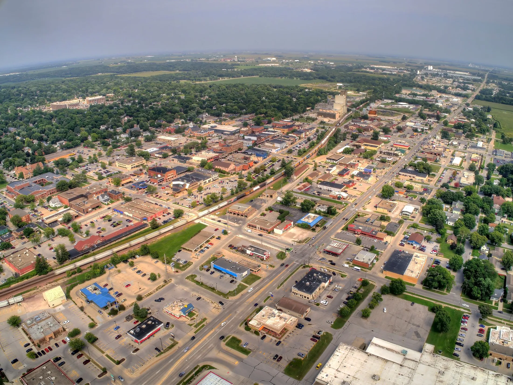

# Ames Housing Price Prediction

## Overview

This project is based on [a well known kaggle competition](https://www.kaggle.com/competitions/house-prices-advanced-regression-techniques) and focuses on predicting housing sale prices in Ames, Iowa using various regression techniques (XGBRegressor, GradientBoostingRegressor, RandomForestRegressor, and VotingRegressor). With a RMSLE of 0.1239 on unseen data the [Extreme Gradient Boosting Regressor](https://github.com/dmlc/xgboost/tree/master) was the best model. I standardized and streamlined the data cleaning and feature engineering and demonstrated increased performance caused by my feature engineering (without feature engineering: RMSLE 0.1247)

## Dataset

The training dataset used in this project over 81 columns describing 2051 sales of residential properties in Ames, Iowa. Unlabeled test data is for submitting predictions to Kaggle

**Features**:

| Feature         | Description                                               |
|-----------------|-----------------------------------------------------------|
| SalePrice       | The property's sale price in dollars. This is the target variable that you're trying to predict. |
| MSSubClass      | The building class                                       |
| MSZoning        | The general zoning classification                         |
| LotFrontage     | Linear feet of street connected to the property           |
| LotArea         | Lot size in square feet                                   |
| Street          | Type of road access                                       |
| Alley           | Type of alley access                                       |
| LotShape        | General shape of property                                  |
| LandContour     | Flatness of the property                                   |
| Utilities       | Type of utilities available                                |
| ... (truncated for brevity) | ...                                                       |
| MoSold          | Month Sold                                                |
| YrSold          | Year Sold                                                 |
| SaleType        | Type of sale                                              |
| SaleCondition   | Condition of sale                                         |

**Target Variable**:
- Sale Price: The target variable to be predicted.

## Feature Engineering

The problem with using this data for predicting sale price is that each column affects the sale price differently. Some remark on the presence of a feature and some describe the quality of that specific feature. I attempted to resolve it by using my map_home() function to map the 'quality' columns to make them ordinal, which are then used to add a quality multiplier to the various types of amenities described in the data. An example of why I did this: A garage should increase your house's value if it is in good condition, if it is in disrepair it is a burden and its presence should decrease the sale price. I used my discretion when creating the maps as there were several different patterns for describing quality
## New Columns Created by `quality_multiplication` Function
#### Abridged slightly - for garages I made columns the same way for condition as I did with quality
| New Column Name | Columns Used | Description |
| --- | --- | --- |
| lot_area_frontage | lot_area, lot_frontage | Represents the product of lot area and frontage. |
| garage_area_type_Attchd_qual | garage_area, garage_type_Attchd, garage_qual | Represents the product of garage area and garage quality for attached garages. |
| garage_area_type_Basment_qual | garage_area, garage_type_Basment, garage_qual | Represents the product of garage area and garage quality for basement garages. |
| garage_area_type_BuiltIn_qual | garage_area, garage_type_BuiltIn, garage_qual | Represents the product of garage area and garage quality for built-in garages. |
| garage_area_type_CarPort_qual | garage_area, garage_type_CarPort, garage_qual | Represents the product of garage area and garage quality for carport garages. |
| garage_area_type_Detchd_qual | garage_area, garage_type_Detchd, garage_qual | Represents the product of garage area and garage quality for detached garages. |
| garage_area_qual | garage_area, garage_qual | Represents the product of garage area and garage quality, irrespective of garage type. |
| garage_area_cond | garage_area, garage_cond | Represents the product of garage area and garage condition. |
| garage_area_finish | garage_area, garage_finish | Represents the product of garage area and garage finish. |
| fireplace_qu_val | fireplace_qu, fireplaces | Represents the product of fireplace quality and the number of fireplaces. |
| pool_qc_area | pool_qc, pool_area | Represents the product of pool quality and pool area. |
| bsmt_sf_qual_type_1 | bsmtfin_sf_1, bsmtfin_type_1 | Represents the product of finished basement area and basement finish type 1. |
| bsmt_total_sf_cond | total_bsmt_sf, bsmt_cond | Represents the product of total basement area and basement condition. |
| bsmt_total_sf_qual | total_bsmt_sf, bsmt_qual | Represents the product of total basement area and basement quality. |
| misc_feature_Gar2_val | misc_feature_Gar2, misc_val | Represents the product of miscellaneous feature "Gar2" and its value. |
| misc_feature_Othr_val | misc_feature_Othr, misc_val | Represents the product of miscellaneous feature "Othr" and its value. |
| misc_feature_Shed_val | misc_feature_Shed, misc_val | Represents the product of miscellaneous feature "Shed" and its value. |
| misc_feature_TenC_val | misc_feature_TenC, misc_val | Represents the product of miscellaneous feature "Tennis Court" and its value. |

## Regression Techniques Explored

Various regression techniques have been implemented and analyzed to predict housing sale prices. The regression models explored in this project include:
1. **Random Forest Regressor**
2. **Gradient Boosting Regressor**
3. **XGB Regressor**
4. **Voting Regressor**

## Project Structure

The project is organized as follows:

- `datasets/`: Contains the dataset files and the predections generated to submit to kaggle competition
- `code/`: Jupyter Notebook for this project and python file to automate preparation of this type of data for modeling

- `images/`: images created in jupyter notebook

## Conclusion

I attempted and succeeded in developing a method to clean and prepare data to be used for training models or making predictions. My feature engineering (quality multiplication) enhanced the performance of every model, including the voting regressor.

The XGBoost (xgb) model demonstrated the best performance on the Kaggle dataset with a public score of 0.09626, while the voting regressor achieved a score of 0.09720. The data used for this analysis was collected for one city before, during, and after the housing collapse of 2008. Predicting house prices based solely on physical features is challenging, as various factors such as schools, neighbors, preferences, and negotiations also influence the sale price. In this project, the best reasonable outcome is accurate predictions the majority of the time. Calculating the error for each prediction reveals that the middle 50% of sales are within 5% of the actual sale price.

**KAGGLE SUBMISSION:** Ranked in the top 2% of scores on the [House Prices: Advanced Regression Techniques Kaggle Leaderboard](https://www.kaggle.com/competitions/house-prices-advanced-regression-techniques/leaderboard) with a score of 0.09626, placing 89th out of 4219 as of Jan 16, 2024 (the voting regressor performed comparably but slightly worse at 0.0972).
